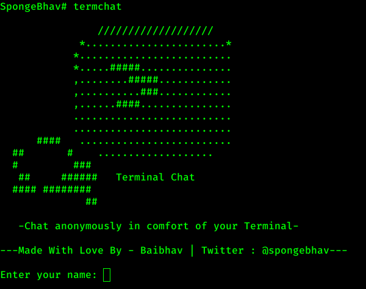
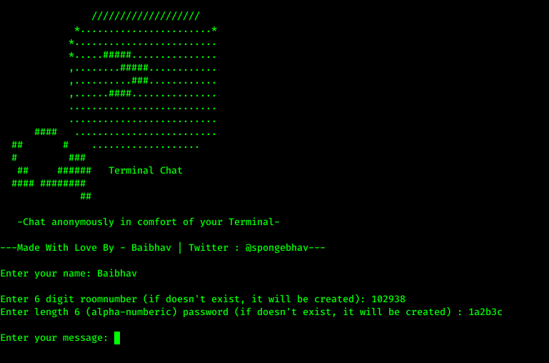
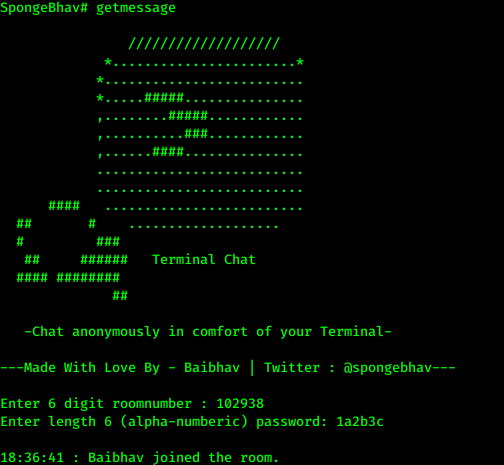

<h1 align="center" style="font-size:36px;font-weight:bold;">
        Terminal Chat 
        -Chat anonymously in comfort of your terminal-
</h1>
<h4 align="center">
    <strong>Made with ❤️ by Baibhav Anand. (<a href='https://twitter.com/spongebhav' target="_blank">@spongebhav</a>)</strong>
</h4>

  

 
 

<h2 align="center">
  <strong>About Terminal Chat</strong>
 </h2>
 
  

 
 

**Terminal Chat** allows user to chat anonymously with one another without the need of creating an account and all of this in the comfort of your terminal.

<h2 align="center">
  <strong>Installation</strong>
 </h2>
 
 * Download OR Clone the repository in your machine:
<pre>git clone https://github.com/baibhavanand/terminalchat</pre>

* Switch to **terminalchat** directory:
<pre>cd terminalchat</pre>

* Switch to **install** directory:
<pre>cd install</pre>

* Give permissions to install.sh file:
<pre>sudo chmod 555 install.sh</pre>

* Run install.sh:
<pre>sudo ./install.sh --install</pre>

<h2 align="center">
  <strong>Usage</strong>
 </h2>
 
 *Works best with terminator - https://terminator-gtk3.readthedocs.io/en/latest/*
 
 * On normal bash shell open two different windows. Or If using terminator make a horizontal split.
 * In the first window type `termchat`
 * In the second window type `getmessage`
 
 In the **termchat** menu:
 

 
 

 
 * Enter your name: *Your Name here* .
 * Enter 6 digit roomnumber (if doesn't exist, it will be created) : *Random 6 digit number* .
 * Enter length 6 (alpha-numberic) password (if doesn't exist, it will be created) : *Length 6 alpha numberic ROOM password* .
 
 
 In the **getmessage** menu:

 

 
 

 
 * Now use the same room number and password here  
 
Now your partner to whom you want to chat with can use the same room number and password to join in the same room and you guys will be able to chat with each other without caring about about data being leaked or accessed and all this in comfort of your terminal.

<h2 align="center">
  <strong>Video demonstration of the chat</strong>
 </h2>

Click on the image below to be redirected to the YouTube video.   
 

<h2 align="center">
  <strong>Contribution</strong>
 </h2>
 
 
      
 If you wish to help me with the server cost to keep the project up and running here is how you can:
        

 
  | 
------------- |-------------
 Send to <strong>terminalchat@baibhavjha.com</strong>     | BitCoin address: <strong>3KrxUGV6shDoqgyzrWF9h2EwBfaeamKVcD </strong>
 
 
 
 
      
 You can also contribute to this project by making this project better and sending in pull request or creating an issue.
        

        
<h2 align="center">
  <strong>Thanks</strong>
 </h2>

 
I would like to thank <a href="https://github.com/baibhavanand/terminalchat/blob/main/thanks.md">the following people</a> for contributing to this project.

 

<i>This project is maintained by <a href="https://github.com/baibhavanand">Baibhav Anand Jha</a> | Twitter: <a href="https://twitter.com/spongebhav">@spongebhav</a></i>

